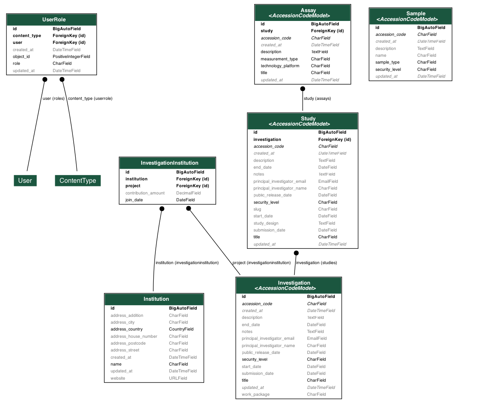

## Entity Relationships

## **Role-Based Access Control (RBAC) Matrix**

| Security Level   | Guest | Internal | Authorized | Contributor | Owner |
|-----------------|--------|-----------|------------|-------------|--------|
| **Public**      | R      | R         | R          | R/W         | R/W    |
| **Internal**    | -      | R         | R          | R/W         | R/W    |
| **Restricted**  | -      | -         | R ¹        | R/W ¹       | R/W    |
| **Confidential**| -      | -         | R ¹²       | R/W ¹²      | R/W ²  |

### **Notes:**
1. Only for resources where the user is explicitly listed in `authorized_users`.  
2. Confidential resources are not visible in metadata catalog listings—direct access only.  

### **Legend:**
- **R** = Read only  
- **R/W** = Read and Write  
- **-** = No access  

---

## **Administrative Permissions Table**

| Action                   | Contributor | Owner |
|--------------------------|------------|-------|
| Add Contributors         | ❌         | ✅    |
| Add Owners               | ❌         | ✅    |
| Modify Access Control    | ❌         | ✅    |
| Remove Users             | ❌         | ✅    |
